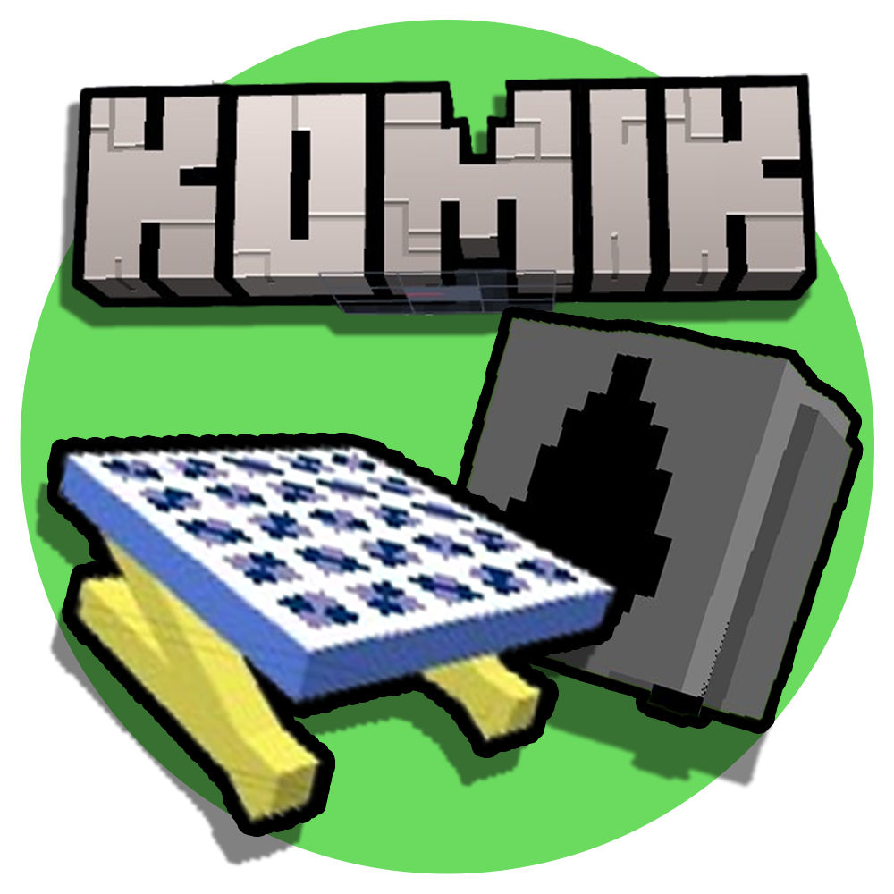

Modrinth page: https://modrinth.com/mod/komik

## Komik

Komik: The all around technology mod which improves vanilla minecraft like non-other. From eco-friendly energy to complex machinery, komik has it all! Currently, Komik is in massive work in progress open-Alpha right now. So it only has a few features. But give it time, and you will see, that it will revolutionise minecraft.

## Open Source

Komik is currently an open-source minecraft mod (appart from files that need to be ignored for security reasons). We are always open for feedback and issue tracking. If you find anything you want to report, please open the [Github page](https://github.com/alsokami/komik/tree/main).

## What Komik Does

Komik as of right now only has a handful of features. The date of today, november 30, 2024, is the first and only day I put as of coding this minecraft mod. The main features it currently has right now is a **400W Solar Panel**, **custom ore generation**, **solar cells**, **oil refinery**, **oil buckets**, and **industrial ores such as silver, aluminum, and silicon**.

## Installation:

To install Komik, you must get the file from the releases/versions tab (depending on if you are on GitHub or Modrinth right now, regardless they both get updates the same),
then navigate to your .minecraft folder and put the Komik.jar file into your mods folder. The minecraft folder will be placed differently on different operating systems, so mind that.

## Wiki:

Komik has a wiki that includes (almost) all features of the mod. You can find it on the github page; https://github.com/alsokami/komik/wiki 

Here is a screenshot of it in action:

## Feedback!

I, alsokami, am currently the only one making this mod right now. I have made everything by myself. As much as I have many ideas, I need yours! I would love to hear out from you. Yes, you! The simple mod user that wants to enjoy simple minecraft technology. Submit your ideas on the Github Forums of the mod's page, and I'll see you there :)
